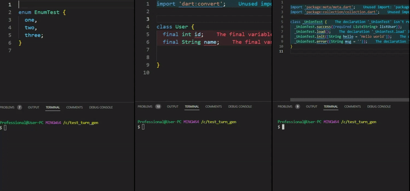
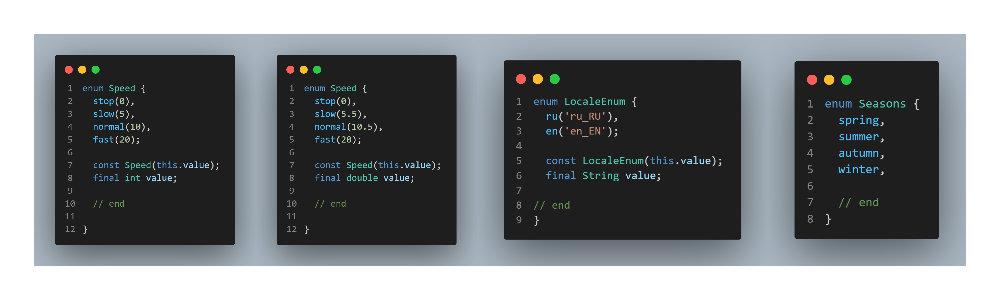

# TurnGen

[](https://pub.dev/packages/turn_gen)

Welcome to [TurnGen]!. This project is a set of scripts combined into a command line tool, all scripts are written in dart language and run instantly without using build_runner, they are designed to minimize coding and simplify various tasks such as:

- Working with Enum classes
- Creating different methods in the Data class
- Generating links to all files in the assets folder
- Create union types from standard constructors



## Install

To use TurnGen, simply add TurnGen to the `pubspec.yaml` file as `dev_dependencies`:

For a Flutter project:

```sh
flutter pub add --dev turn_gen
```

For a Dart project:

```sh
dart pub add --dev turn_gen
```

If you are going to use a link generator for files in the resources folder, you can add the path to the output file in `pubspec.yami`, by default the file is generated in `lib/gen/`:

```yaml
turn_gen:
  assets_output: "lib/app_gen/" 
```

If you set `show_comments` to `true` in `pubspec.yaml`, this means that comments on methods and variables will be displayed in your code, which greatly improves its readability and helps you understand what is going on. By default, this setting is disabled.

```yaml
turn_gen:
  show_comments: true
```

Then run `flutter pub get` or `dart pub get` to install the package.

## Use

### Automatic detection of the running script

TurnGen can be run with a single command that searches for files that have a comment:

```dart
// turngen
```
We use the command to start it:

```shell
dart run turn_gen
```

For example, when using the `union` script:

```dart
import 'package:meta/meta.dart';
// turngen
/* no: tojson fromJson */
@immutable
class _ConnectivityState {
  const _ConnectivityState.isDisonnected();
  const _ConnectivityState.isConnected();
  const _ConnectivityState.notDetermined();
}
// end
```

For example, when using the `data` script:

```dart
// import 'package:meta/meta.dart';
// turngen
@immutable
class DataFio {
  /* init:'' */
  final String surname;
  /* init:'' */
  final String name;
  /* init:'' */
  final String patronymic;
  // end
}

```

For example, when using the `enum` script :

```dart
// turngen
enum EnumLang  {
  ru,
  en;
// end
}
```

Or:

```dart
// turngen
enum EnumActivity  {
  normal(10),
  light(5),
  none(0);

  const EnumActivity(this.value);
  final int value;
// end
}
```


But it takes a bit longer to run this command than to directly call the desired script, which are described below.

### Enum Script


The figure above shows some of the ways in which the `enum` classes can be used.
Turngen adds additional methods for convenient work with `enum`. At what it is unimportant what type of a variable in the constructor. The main thing is to add the comment `// end` before the closing brace to understand where the generation starts from.
Following is the command to run the script.

```shell
dart run turn_gen -t enum -f <path to your file>
```

If you use `VSCode`, you can add the task to your `tasks.json`

```json
    {
      "label": "turn_gen enum",
      "type": "dart",
      "command": "dart",
      "args": ["run", "turn_gen", "-t", "enum", "-f", "${file}"],
    },
   
```

After running the script, you will get additional methods and override the standard ones:

- `fromValue`
- `map`
- `maybeMap`
- `maybeMapOrNull`
- `mapValue`
- `maybeMapValue`
- `maybeMapOrNullValue`
- `getValues`
- `compareTo`
- `toString`

#### Example
  
```dart
// turngen
enum Speed implements Comparable<Speed> {
  stop(0),
  slow(5),
  normal(10),
  fast(20);

  const Speed(this.value);

  final int value;
  // end

//          --TURN_GEN--
//             (enum)
//  *************************************
//         GENERATED CODE
//  *************************************

  static Speed fromValue(
    int? value, {
    Speed? fallback,
  }) {
    switch (value) {
      case 0:
        return stop;
      case 5:
        return slow;
      case 10:
        return normal;
      case 20:
        return fast;
      default:
        return fallback ??
            (throw ArgumentError.value(
              value,
              '',
              'Value not found in Speed',
            ));
    }
  }

  T map<T>({
    required T Function() stop,
    required T Function() slow,
    required T Function() normal,
    required T Function() fast,
  }) {
    switch (this) {
      case Speed.stop:
        return stop();
      case Speed.slow:
        return slow();
      case Speed.normal:
        return normal();
      case Speed.fast:
        return fast();
    }
  }

  T mapValue<T>({
    required T stop,
    required T slow,
    required T normal,
    required T fast,
  }) {
    switch (this) {
      case Speed.stop:
        return stop;
      case Speed.slow:
        return slow;
      case Speed.normal:
        return normal;
      case Speed.fast:
        return fast;
    }
  }

  T maybeMap<T>({
    required T Function() orElse,
    T Function()? stop,
    T Function()? slow,
    T Function()? normal,
    T Function()? fast,
  }) =>
      map<T>(
        stop: stop ?? orElse,
        slow: slow ?? orElse,
        normal: normal ?? orElse,
        fast: fast ?? orElse,
      );

  T maybeMapValue<T>({
    required T orElse,
    T? stop,
    T? slow,
    T? normal,
    T? fast,
  }) =>
      mapValue<T>(
        stop: stop ?? orElse,
        slow: slow ?? orElse,
        normal: normal ?? orElse,
        fast: fast ?? orElse,
      );

  T? maybeMapOrNull<T>({
    T Function()? stop,
    T Function()? slow,
    T Function()? normal,
    T Function()? fast,
  }) =>
      maybeMap<T?>(
        orElse: () => null,
        stop: stop,
        slow: slow,
        normal: normal,
        fast: fast,
      );

  T? maybeMapOrNullValue<T>({
    T? stop,
    T? slow,
    T? normal,
    T? fast,
  }) =>
      maybeMapValue<T?>(
        orElse: null,
        stop: stop,
        slow: slow,
        normal: normal,
        fast: fast,
      );

  static List<int> getValues() => Speed.values.map((e) => e.value).toList();

  @override
  int compareTo(Speed other) => index.compareTo(other.index);

  @override
  String toString() => 'Speed.$name';
}

extension SpeedX on Speed {
  bool get stop => this == Speed.stop;
  bool get slow => this == Speed.slow;
  bool get normal => this == Speed.normal;
  bool get fast => this == Speed.fast;
}


```

### Assets Script

TurnGen also allows you to generate string constants of all files in the assets folder, with the ability to use different characters and letters in the file name, and, if identical file names are found, to add to the constant name a number

If you need a different path in which to generate the file, use the setting below in `pubspec.yaml`:

```yaml
turn_gen:
  assets_output: "lib/gen/" 
```

And to start, we use the command:

```shell
dart run turn_gen assets
```

If you are using `VSCode`, you can add the task to your `tasks.json`.

```json
    {
      "label": "turn_gen assets",
      "type": "shell",
      "command": "dart run turn_gen assets",
      "problemMatcher": []
    },
```

After running the script, you will get all the file paths in one class:

#### Example Assets generator

```dart
class AssetPaths {
  const AssetPaths._();
 
  /// * Size: 8.8 KB
  /// * File path: _assets/icons/app_icons.ttf
  static const String appIconsIcons = 'assets/icons/app_icons.ttf';
 
  /// * Size: 24.6 KB
  /// * File path: _assets/image/onboarding_remind_you.svg
  static const String onboardingRemindYouImage = 'assets/image/onboarding_remind_you.svg';
 
  /// * Size: 60.8 KB
  /// * File path: _assets/image/splash.png
  static const String splashImage = 'assets/image/splash.png';
 
  /// * Size: 4.8 KB
  /// * File path: _assets/lottie/load_btn.json
  static const String loadBtnLottie = 'assets/lottie/load_btn.json';
  
  ...
  
    /// List of TTF assets
  static const List<String> valuesTTF = [appIconsIcons];

  /// List of SVG assets
  static const List<String> valuesSVG = [onboardingRemindYouImage, icErrorSvg, icErrorCloseSvg, icInfoSvg, icInfoCloseSvg, icSuccessSvg, icSuccessCloseSvg, icWarningSvg, icWarningCloseSvg, logoSvg, onb1Svg, onb2Svg, onb3Svg, onb4Svg, sortAscSvg, sortDescSvg];

  /// List of PNG assets
  static const List<String> valuesPNG = [splashImage];

  /// List of JSON assets
  static const List<String> valuesJSON = [loadBtnLottie, loadPageLottie, waterDownLottie, waterUpLottie];

  /// List of all assets
  static const List<String> valuesAll = [appIconsIcons, onboardingRemindYouImage, splashImage, loadBtnLottie, loadPageLottie, waterDownLottie, waterUpLottie, icErrorSvg, icErrorCloseSvg, icInfoSvg, icInfoCloseSvg, icSuccessSvg, icSuccessCloseSvg, icWarningSvg, icWarningCloseSvg, logoSvg, onb1Svg, onb2Svg, onb3Svg, onb4Svg, sortAscSvg, sortDescSvg];

}


```

### Data Script

TurnGen scripts can generate and override additional methods to `dart` classes, such as

- `toMap`/`fromJson` and `fromMap`/`fromJson`/`fromDynamicMap` for Map/Json serialization and deserialization
- `copyWith` - to clone an object with different properties
- `operator ==` and override `hashCode` (since TurnGet only works with immutable classes)
- `toString` -  to display a list of all object properties

Most importantly, we use the standard `dart` class simply by adding comments to the body for customization, the obligatory comments are shown below:

```dart
@immutable
class RegistrationState {
  final bool isLoad;
  final String? name;
  final List<int> activitySelected;
// end
}
```

Now let's describe the basic conditions for using TurnGen:

- All fields of the class must be - `final`
- After declaring all the fields, put a comment at the end - `// end`

And that's it!

#### Additional class settings

You can add an additional setting at the beginning of the class, also using comments, for example:

- There will only be a copyWith method.

```dart
/* only: copyWith  */
class RegistrationState {
...
```

- Remove a certain method or several

```dart
/* no: fromMap toMap  */
class RegistrationState {
...
```

- Use the `equatable` library

```dart
/* use: equatable  */
class RegistrationState {
...
```

In the examples above, you can combine different options from other methods

#### Additional variable settings

The variable also has settings, we just write our keywords in the comments above the class, for example:

- You can initialize the variable with any text

```dart
  /* init: true */
  final bool isLoad;
  /* init: 'Jon' */
  final String name;
```

- If the type of the variable is not defined, `TurnGen` will try to determine it and prompt you about it, but you can explicitly specify it with the keyword: `type:` and possible options `enum` `data` `List<data>`

```dart
/*
type: enum
init: FormzSubmissionStatus.initial
*/
  final FormzSubmissionStatus status;
/*
type: data
init: const DateRegModel()
*/
  final DateRegModel dateRegModel;
 /* type: List<data> */
  final List<Name> nameList;
```

- Override `toMap` or `fromMap` methods if TurnGen does not define a variable type

```dart
/*
init: const DateRegModel()
fromMap: DateRegModel.fromMap(map['dateRegModel'] as Map<String, dynamic>)
toMap: dateRegModel.toMap()
*/
  final DateRegModel dateRegModel;
```

#### Use

And to start, we use the command:

```shell
dart run turn_gen
# or
dart run turn_gen -t data -f <path to your file>
```

If you use `VSCode`, you can add the task to your `tasks.json`

```json
    {
      "label": "turn_gen data",
      "type": "dart",
      "command": "dart",
      "args": ["run", "turn_gen", "-t", "data", "-f", "${file}"]
    }
```

After executing the script you get a typical `dart` class with new and overridden methods :

#### Example

```dart

import 'dart:convert';
import 'package:collection/collection.dart';
import 'package:meta/meta.dart';

// turngen
@immutable
class RegistrationState {
  final bool isLoad;
  final String? name;
  final List<int> activitySelected;

// end

//          --TURN_GEN--
//             (data)
//  *************************************
//         GENERATED CODE
//  *************************************
  const RegistrationState({
    required this.isLoad,
    required this.activitySelected,
    this.name,
  });

  Map<String, dynamic> toMap() {
    return <String, dynamic>{
      'isLoad': isLoad,
      'name': name,
      'activitySelected': activitySelected,
    };
  }

  factory RegistrationState.fromMap(Map<dynamic, dynamic> map) {
    return RegistrationState(
      isLoad: map['isLoad'] != null
          ? map['isLoad'] as bool
          : throw Exception(
              "map['isLoad']_type_'Null'",
            ),
      name: map['name'] as String?,
      activitySelected: map['activitySelected'] != null
          ? (map['activitySelected'] as List<dynamic>)
              .map((e) => e as int)
              .toList()
          : throw Exception(
              "map['activitySelected']_type_'Null'",
            ),
    );
  }

  RegistrationState copyWith({
    bool? isLoad,
    String? name,
    List<int>? activitySelected,
  }) {
    return RegistrationState(
      isLoad: isLoad ?? this.isLoad,
      name: name ?? this.name,
      activitySelected: activitySelected ?? this.activitySelected,
    );
  }

  String toJson() => json.encode(toMap());
  factory RegistrationState.fromJson(String source) =>
      RegistrationState.fromMap(
        json.decode(source) as Map<String, dynamic>,
      );

  @override
  bool operator ==(dynamic other) {
    return identical(this, other) ||
        (other.runtimeType == runtimeType &&
            other is RegistrationState &&
            (identical(
                  other.isLoad,
                  isLoad,
                ) ||
                other.isLoad == isLoad) &&
            (identical(
                  other.name,
                  name,
                ) ||
                other.name == name) &&
            const DeepCollectionEquality().equals(
              other.activitySelected,
              activitySelected,
            ));
  }

  @override
  int get hashCode => Object.hashAll([
        runtimeType,
        isLoad,
        name,
        const DeepCollectionEquality().hash(
          activitySelected,
        ),
      ]);

  @override
  String toString() {
    return 'RegistrationState(isLoad: $isLoad, name: $name, activitySelected: $activitySelected, )';
  }
}
```

### Union Script

TurnGen scripts can generate "union types" by creating a class with named constructors, but this requires making a fake private class. This class is not used anywhere, but it is useful for modifying the generated code. And add a `// end` comment at the end of the class, like in the example below:

```dart
import 'package:collection/collection.dart';
import 'package:meta/meta.dart';

// turngen
class _Union {
  _Union.success({required List<User> listUser});
  _Union.load();
  _Union.init([String hello = 'Hello world']);
  _Union.error({String msg = ''});
}

// end
```

#### Use

And to start, we use the command:

```shell
dart run turn_gen
# or
dart run turn_gen -t union -f <path to your file>
```

If you use `VSCode`, you can add the task to your `tasks.json`

```json
    {
      "label": "turn_gen union",
      "type": "dart",
      "command": "dart",
      "args": ["run", "turn_gen", "-t", "union", "-f", "${file}"]
    }
```

After running the script, you will get additional methods and override the standard ones:

- `map`
- `maybeMap`
- `mapOrNull`
- `when`
- `compareTo`
- `toString`, `operator ==`, `hashCode`

#### toJson fromJson

Added the ability to convert a `Union` class to a JSON string and vice versa. When performing the initial conversion, you need to provide a `tag`. However, for subsequent conversions, the `tag` parameter is optional.

```dart

// union class example

// turngen
@immutable
class _ApiLoanSchedule {
  
  /// Creates a successful API loan schedule.
  const _ApiLoanSchedule.success({
    List<ApiLoanScheduleItem> list = const [],
  });

  /// Creates an error API loan schedule.
  const _ApiLoanSchedule.error({
    String message = '',
    String error = '',
    String code = '',
  });
}


// ... other code


// Deserialize the class
return response.statusCode == 200
          ? ApiLoanSchedule.fromJson(
              response.data,
              ApiLoanScheduleTag.success,
            )
          : ApiLoanSchedule.fromJson(
              response.data,
              ApiLoanScheduleTag.error,
            );


// how to use

 loanScheduleModel.map(
      success: (v) {
// Something to do
      },
      error: (v) {
// Something to do
      },
    );

// Data serialization
  final loanScheduleJson = loanScheduleModel.toJson();

```

#### Example of generated file

```dart

class _Union {
  _Union.success({required List<User> listUser});
  _Union.load();
  _Union.init([String hello = 'Hello world']);
  _Union.error({String msg = ''});
}
// end

//          --TURN_GEN--
//  *************************************
//           GENERATED CODE 
//  *************************************
  
@immutable
class Union {
  const Union.success({required List<User> listUser}):
        _tag = _UnionTag.success,
        _listUser_success = listUser,
        _hello_init = null,
        _msg_error = null;
  const Union.load():
        _tag = _UnionTag.load,
        _listUser_success = null,
        _hello_init = null,
        _msg_error = null;
  const Union.init([String hello = 'Hello world']):
        _tag = _UnionTag.init,
        _listUser_success = null,
        _hello_init = hello,
        _msg_error = null;
  const Union.error({String msg = ''}):
        _tag = _UnionTag.error,
        _listUser_success = null,
        _hello_init = null,
        _msg_error = msg;

  T? mapOrNull<T>({
    T? Function(_UnionSuccess v)? success,
    T? Function(_UnionLoad v)? load,
    T? Function(_UnionInit v)? init,
    T? Function(_UnionError v)? error,
  }) {
    switch (_tag) {
      case _UnionTag.success:
        return success?.call(_UnionSuccess(_listUser_success!));
      case _UnionTag.load:
        return load?.call(const _UnionLoad());
      case _UnionTag.init:
        return init?.call(_UnionInit(_hello_init!));
      case _UnionTag.error:
        return error?.call(_UnionError(_msg_error!));
    }
  }

  T map<T>({
    required T Function(_UnionSuccess v) success,
    required T Function(_UnionLoad v) load,
    required T Function(_UnionInit v) init,
    required T Function(_UnionError v) error,
  }) {
    switch (_tag) {
      case _UnionTag.success:
        return success(_UnionSuccess(_listUser_success!));
      case _UnionTag.load:
        return load(const _UnionLoad());
      case _UnionTag.init:
        return init(_UnionInit(_hello_init!));
      case _UnionTag.error:
        return error(_UnionError(_msg_error!));
    }
  }

  T maybeMap<T>({
    T Function(_UnionSuccess v)? success,
    T Function(_UnionLoad v)? load,
    T Function(_UnionInit v)? init,
    T Function(_UnionError v)? error,
      required T Function() orElse,
  }) {
    switch (_tag) {
      case _UnionTag.success:
        if(success != null) return success(_UnionSuccess(_listUser_success!));
        return orElse();
      case _UnionTag.load:
        if(load != null) return load(const _UnionLoad());
        return orElse();
      case _UnionTag.init:
        if(init != null) return init(_UnionInit(_hello_init!));
        return orElse();
      case _UnionTag.error:
        if(error != null) return error(_UnionError(_msg_error!));
        return orElse();
    }
  }

  T when<T>({
    required T Function (List<User> listUser) success,
    required T Function () load,
    required T Function (String hello) init,
    required T Function (String msg) error,
}) {
    switch (_tag) {
      case _UnionTag.success:
        return success(_listUser_success!);
      case _UnionTag.load:
        return load();
      case _UnionTag.init:
        return init(_hello_init!);
      case _UnionTag.error:
        return error(_msg_error!);
    }
  }

  @override
  bool operator ==(dynamic other) {
    switch (_tag) {
      case _UnionTag.success:
        return identical(this, other) ||
        (other.runtimeType == runtimeType &&
            other is Union  &&  
 const DeepCollectionEquality().equals(other._listUser_success, _listUser_success,)); 
      case _UnionTag.load:
        return identical(this, other) ||
        (other.runtimeType == runtimeType &&
            other is Union ); 
      case _UnionTag.init:
        return identical(this, other) ||
        (other.runtimeType == runtimeType &&
            other is Union  &&  
 (identical(other._hello_init, _hello_init) || other._hello_init == _hello_init)); 
      case _UnionTag.error:
        return identical(this, other) ||
        (other.runtimeType == runtimeType &&
            other is Union  &&  
 (identical(other._msg_error, _msg_error) || other._msg_error == _msg_error));   
  }
}
  @override
  int get hashCode {
    switch (_tag) {
      case _UnionTag.success:
        return Object.hashAll([runtimeType, const DeepCollectionEquality().hash(_listUser_success)]);
      case _UnionTag.load:
        return Object.hashAll([runtimeType]);
      case _UnionTag.init:
        return Object.hashAll([runtimeType, _hello_init]);
      case _UnionTag.error:
        return Object.hashAll([runtimeType, _msg_error]);  
  }
}
  @override
  String toString() {
    switch (_tag) {
      case _UnionTag.success:
        return 'Union.success(listUser: $_listUser_success)';
      case _UnionTag.load:
        return 'Union.load()';
      case _UnionTag.init:
        return 'Union.init(hello: $_hello_init)';
      case _UnionTag.error:
        return 'Union.error(msg: $_msg_error)';  
  }
}
  final _UnionTag _tag;
  final List<User>? _listUser_success;
  final String? _hello_init;
  final String? _msg_error;

}

enum _UnionTag {
  success,
  load,
  init,
  error,
}
@immutable
class _UnionSuccess extends Union {
  const _UnionSuccess(this.listUser) : super.success(listUser: listUser);
  final List<User> listUser;
}
@immutable
class _UnionLoad extends Union {
  const _UnionLoad() : super.load();
}
@immutable
class _UnionInit extends Union {
  const _UnionInit(this.hello) : super.init( hello);
  final String hello;
}
@immutable
class _UnionError extends Union {
  const _UnionError(this.msg) : super.error(msg: msg);
  final String msg;
}
```

### Update all files

In case it is necessary to update all files where `TurnGen` was used, and these are files with text:

```dart
//          --TURN_GEN--
//             (data)
//  *************************************
//         GENERATED CODE 
//  *************************************
```

It is enough to run the command:

```sh
dart run turn_gen build
```

TurnGen will find all the files and update them, this command is similar to the `build_runner` command, but relatively faster.

## Help

If you encounter any issues [please report them here](https://github.com/a-dev-mobile/turn_gen/issues).

### License

Copyright 2023 TurnGen

Licensed under the Apache License, Version 2.0 (the "License");
you may not use this file except in compliance with the License.
You may obtain a copy of the License at

    http://www.apache.org/licenses/LICENSE-2.0

Unless required by applicable law or agreed to in writing, software
distributed under the License is distributed on an "AS IS" BASIS,
WITHOUT WARRANTIES OR CONDITIONS OF ANY KIND, either express or implied.
See the License for the specific language governing permissions and
limitations under the License.

[turngen]: https://github.com/a-dev-mobile/turn_gen/
